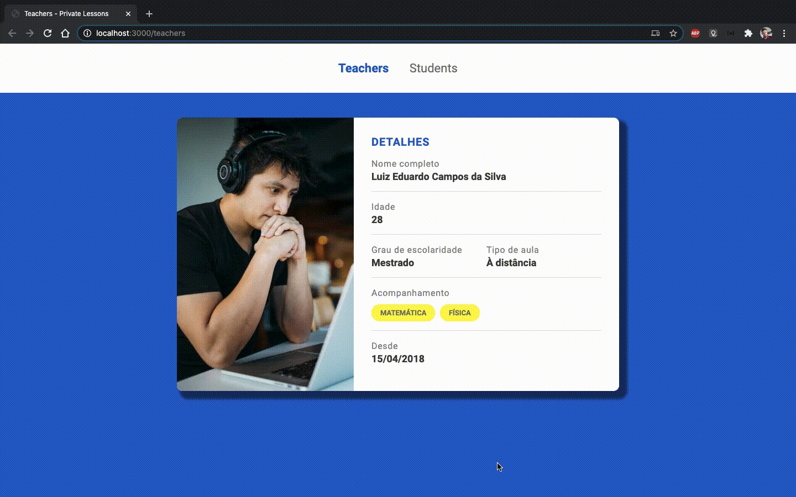

<h1 align="center" style="
  color: #2962ca;
  font-weight: bold;
  font-size: 50px">
  Private Lessons
</h1>

<h1>
  
</h1>

<p align="center">
  <a href="#bookmark-sobre">Sobre</a> |
  <a href="#computer-tecnologias-utilizadas">Tecnologias</a> |
  <a href="#dart-objetivo">Objetivo</a> |
  <a href="#package-como-baixar-o-projeto">Baixar</a>
</p>

## :bookmark: Sobre
Sistema de gerenciamento de professores e alunos em aulas particulares
Ainda em desenvolvimento...

## :computer: Tecnologias Utilizadas
- HTML
- CSS

## :dart: Objetivo
Sistema tem como objetivo disponibilizar:
- Página de professores
- Página de alunos

## :package: Como Baixar o projeto
Pelo seu terminal, escolha um local para o projeto e rode os comandos:
```bash
  # Clonar o repositório
  $ git clone https://github.com/luizcampos331/private-lessons.git

  # Entrar no diretório
  $ cd private-lessons

  # Instalar dependências
  $ npm install

```
